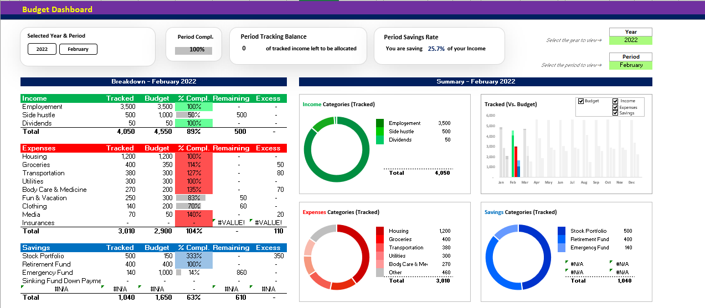

# 💰 Personal Budget Management System – Excel

> A dynamic and structured Excel-based budgeting system to track income, expenses, and savings with automated calculations and interactive dashboard insights.
>
> 
---

## 📌 Project Overview

The **Personal Budget Management System** is designed to help users plan, track, and analyze their financial activities efficiently.

It follows a modular structure with separate sheets for planning, tracking, backend calculations, and dashboard visualization — ensuring clean data flow and structured financial reporting.

---

## 🧩 Project Structure

| Sheet Name          | Purpose                                           |
| ------------------- | ------------------------------------------------- |
| **Settings**        | Control panel for year selection & configurations |
| **Budget Planning** | Define monthly/yearly income & expense targets    |
| **Budget Tracking** | Record actual transactions                        |
| **Calculations**    | Backend automated computations                    |
| **Dashboard**       | Visual financial insights & KPIs                  |
| **Dropdown Data**   | Category & validation data management             |

---

## 🚀 Key Features

* 📅 Budget Planning Sheet for monthly & yearly targets
* 🧾 Budget Tracking Sheet for real-time expense recording
* 📊 Automated variance calculation (Planned vs Actual)
* 📈 Interactive dashboard with year-based dynamic selection
* 🔽 Dropdown-based category management using data validation
* ⚙ Backend calculation engine for clean logic separation
* 🚨 Conditional formatting alerts for overspending
* 📌 Structured and scalable Excel modeling approach

---

## 📊 Summary KPIs Included

* 💵 Total Income
* 💸 Total Expenses
* 💰 Savings
* 📉 Variance Analysis
* 📆 Monthly Trend Overview

---

## 🛠 Excel Skills Demonstrated

* Advanced formulas: `SUMIFS`, `IF`, `IFERROR`
* Logical structuring of multi-sheet models
* Data validation & dropdown controls
* Named ranges
* Conditional formatting for alerts
* Dashboard layout & visual design principles
* Financial variance analysis
* Clean Excel architecture & modeling approach

---

## 📈 Business Insights Enabled

* Monthly spending trends
* Category-wise expense breakdown
* Budget vs Actual performance comparison
* Yearly financial overview
* Overspending identification & control

---

## 🎯 Project Objective

To build a structured and automated personal finance management system using Microsoft Excel that demonstrates strong analytical thinking, financial planning logic, and dashboard development skills.

---

## 👨‍💻 Author

**Dheeraj R. Singh**

 - Data Analyst | Excel | Power BI | BI Projects

🔗 GitHub: [https://github.com/DHEERAJ09R08SINGH](https://github.com/DHEERAJ09R08SINGH)

🔗 LinkedIn: [https://www.linkedin.com/in/dheeraj-r-singh/](https://www.linkedin.com/in/dheeraj-r-singh-9b4370250/)

